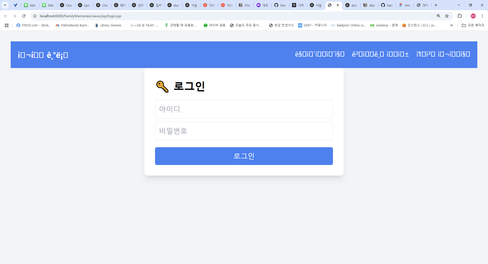
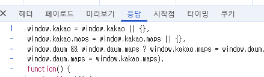
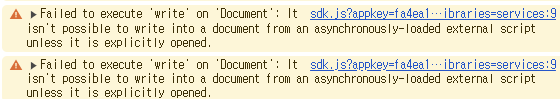
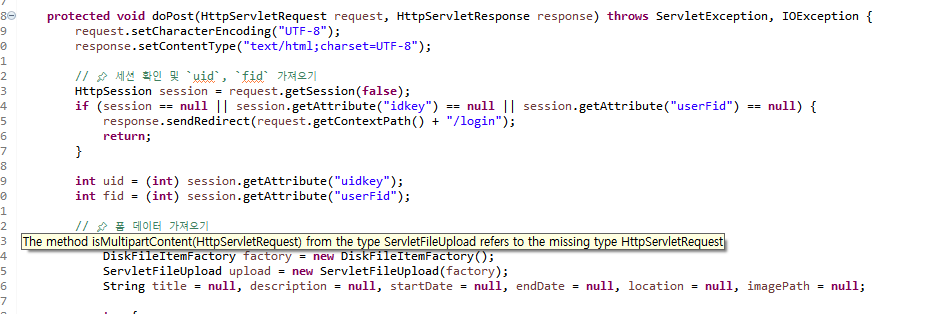

# JSP/Servlet 기반 가족여행 기록 서비스 - 여가錄

<br>

'여가錄'은 여행·가족·기록(錄)의 줄임말로, 가족과 함께한 여행을 **사진이나 지도, 캘린더로 남기고 공유하는 서비스**입니다. <br>

특히 60대 이상 사용자도 부담없이 이용하실 수 있도록, 단순한 사용 흐름과 필수 기능 중심으로 설계했습니다.

<br>

#### • 기술 목표

<p>
  
  
  
  
</p>

− Jakarta Servlet 6과 JSP로 구현하여 웹 애플리케이션의 핵심 동작 원리를 직접 구현한다. <br>

− 사용자 인증과 상태 유지를 위해 HTTP Session을 적용한다. <br>

− 데이터 처리는 JDBC로 MySQL과 연동하여 CRUD 형태로 다룬다.

<br>

#### • 프로젝트 기간

📆 2025.02.03 ~ 2025.02.10

<br>

#### • 소스 트리 & 레이어 개요

[🔗 src/main 바로가기 클릭](./src/main)


<br>

#### • 웹 요청 처리 파이프라인


<br>

#### • ERD

[🔗 DB 스키마 바로가기 클릭](./sql/DDL.sql)


<br><br>

#### • 팀원 소개

|||||
|:-:|:-:|:-:|:-:|
|[@riyeong0916](https://github.com/riyeong0916)|[@parkjhhh](https://github.com/parkjhhh)|[@CooolRyan](https://github.com/CooolRyan)|[@HyeJinSeok](https://github.com/HyeJinSeok)|


<br>

---


## ◈ 프로젝트 개요

<br>

가족 구성원 모두가 편리하게 이용할 수 있도록 △스마트폰 활용에 익숙하고 △여행에 제약이 적으며 △비교적 경제적 여유로 여행 빈도가 높은 계층을 주요 타깃으로 설정했습니다. <br>

이 기준을 바탕으로 2030 자녀 세대 유입을 출발점으로 삼고, 궁극적으로는 본래 타깃인 **은퇴 후 여유로운 삶**을 즐기려는 50~60대까지 자연스럽게 확산되는 흐름을 목표로 합니다. <br>

아울러 10세 미만 자녀를 둔 30~40대 부모는 가족 기록에 적극적이며 사진을 자주 남기는 경향이 있어, 초반 주요 사용자군으로 자리 잡을 가능성이 큽니다. 이를 통해 여가錄의 초기 인지도 제고 효과도 기대할 수 있습니다.

<br>

### 🔸화면 흐름도


<br>

### 🔸가족여행 기록 및 플랜 추천 애플리케이션

- Kakao Maps API 기반 여행지 탐색·마커(핀) 표시 기능 구현

- 여행 기록 포스팅 (사진 업로드 및 게시글 작성 가능)

- ElasticSearch 기반 인기 여행지 분석 및 연관 검색어 추천 시스템 구축 (아이디어 단계)

<br>

### 🔸예상 타겟 고객층

- 50~60대 부모 세대 → 2030 자녀 세대를 통해 자연스럽게 유입

- 30~40대 부모 세대 → 영유아 자녀를 둔 가족 단위의 추가 유입

<br>

---


## ◈ 주요 기능

<br>

### ① 회원가입 및 로그인 


- 이름, 아이디, 비밀번호, 이메일, 가족 그룹ID를 입력하여 회원가입을 합니다. 

- 만약 실패시 "회원가입에 실패했습니다. 다시 시도해주세요." 문구가 뜬다.

<br><br>

### ② 메인 페이지


- main 페이지에서는 가족들이 적은 모든 게시물과 캘린더 형태로 일정을 확인 가능합니다.

- 가족 여행 기록에 적혀있는 장소들을 지도에서 **핀 형태로**도 확인할 수 있습니다.

<br><br>

### ③ 마이페이지


- 마이페이지에서는 본인이 작성한 게시글, 본인 및 가족 정보를 확인 가능합니다.

- 내가 쓴 게시물의 제목을 누르면 내용과 장소, 여행날짜와 사진이 뜹니다. 

<br><br>

### ④ 게시글 작성


- 게시글을 올리기 위해 제목과 내용, 여행 날짜를 작성합니다. 

- 키워드를 입력하면 장소를 검색할 수 있고, 장소를 선택하면 자동적으로 위치가 선택됩니다. 

- 사진 파일을 선택해서 올리고 게시글을 등록합니다. 

<br>

#### ⑥ 추천 여행지 (아이디어만)


- ELK를 활용해서 DB에 저장된 포스팅 글을 분석하고 연관 단어나 추천 키워드를 제시

<br>

---

## ◈ Trouble Shooting

<br>

### ▸ include UTF-8 깨짐 현상 
```
<%@ page language="java" contentType="text/html; charset=UTF-8"
    pageEncoding="UTF-8"%>
<!DOCTYPE html>
<html>
<head>
<meta charset="UTF-8">
<title>Insert title here</title>
</head>
<body>
	<nav class="bg-blue-500 p-4 text-white flex justify-between">
	    <a href="main.jsp" class="text-lg font-bold">여행 기록</a>
	    <ul class="flex space-x-4">
	        <li><a href="mypage.jsp" class="hover:underline">마이페이지</a></li>
	        <li><a href="post.jsp" class="hover:underline">게시글 작성</a></li>
	        <li><a href="recommend.jsp" class="hover:underline">추천 여행지</a></li>
	    </ul>
	</nav>

</body>
</html>
```





```
<%@ page contentType="text/html; charset=UTF-8" pageEncoding="UTF-8" %>
```


- pageEncoding으로 해결 불가

<br><br>


### ▸ window 객체 내 kakao 변수



- response 객체를 확인한 결과 kakao 객체는 window 객체 하위의 프로퍼티로 추가됨

<br>

### ▸ Failed to execute 'write' on 'Document'

- 비동기로 로드 (async defer) 된 카카오 API가 내부적으로 document.write()를 실행<br>
- 비동기 스크립트에서는 document.write()가 차단됨 → 크롬 최신 버전에서 오류 발생<br>
- 카카오 API가 정상적으로 로드되지 않아 window.kakao.maps가 undefined 상태로 남음<br><br><br>


✅ **async defer 제거 후 onload 이벤트로 실행**<br>



<br>

### ▸ Enctype = multipart 객체 전달 간 오류

<br><br>


- 이전 servlet의 경우 enctype 변환을 통한 form 전달은 apache commons 관련 lib을 통해 이루어짐


- 그러나 이를 사용하자 HttpServletRequest request 객체 인식 문제가 발생


- 현재 servlet은 6 버전으로 이전 lib와 호환이 되지 않음을 짐작함

<br>

```
 File uploadDir = new File(uploadPath);
        if (!uploadDir.exists()) {
            uploadDir.mkdirs(); // 폴더가 없으면 생성
        }

        String imgsrc = null;
        Part filePart = request.getPart("imgsrc"); // `imgsrc` input name 가져오기
        if (filePart != null && filePart.getSize() > 0) {
            String fileName = UUID.randomUUID().toString() + "_" + filePart.getSubmittedFileName();
            imgsrc = "uploads/" + fileName; // DB에 저장할 상대 경로

            // 파일 저장
            Path filePath = Path.of(uploadPath, fileName);
            Files.copy(filePart.getInputStream(), filePath, StandardCopyOption.REPLACE_EXISTING);
        }
```

<br>

- servlet 6버전에 맞는 File 전달 방식을 사용. getPart를 통해 파일 물리 정보를 받아옴.


```
@MultipartConfig(
	    fileSizeThreshold = 1024 * 1024 * 1, // 1MB
	    maxFileSize = 1024 * 1024 * 10,      // 10MB
	    maxRequestSize = 1024 * 1024 * 15    // 15MB
	)
```

