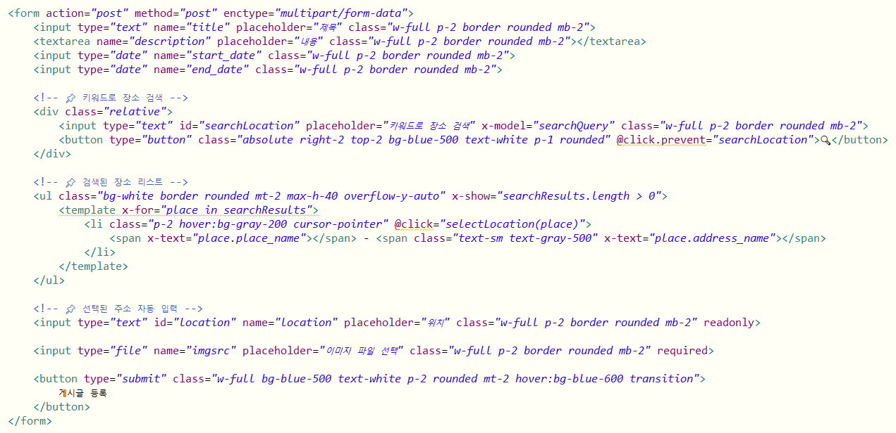
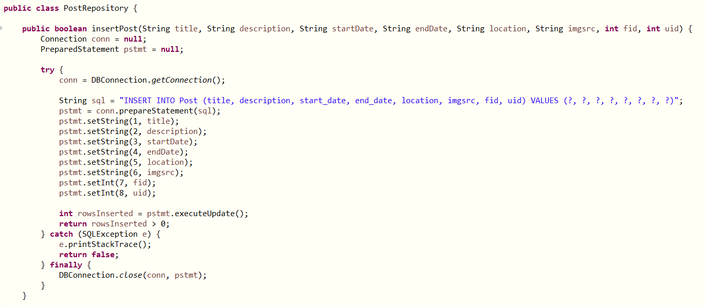

# 여가錄(록)

<br>

## 👨‍👩‍👧‍👦 팀원 소개

|||||
|:-:|:-:|:-:|:-:|
|김리영 (Kim Ri-yeong)<br/>[@riyeong0916](https://github.com/riyeong0916)|Park ji hye<br/>[@parkjhhh](https://github.com/parkjhhh)|Ryan Na<br/>[@CooolRyan](https://github.com/CooolRyan)|[@HyeJinSeok](https://github.com/HyeJinSeok)|


<br>

## 🚀 프로젝트 목표
### ▸ 여가錄

- **여가錄**은 여행, 가족, 기록의 줄임말이며 **가족과 함께 소중한 여행의 추억을 기록하고 가족과 공유하는 서비스**입니다.
- 해당 서비스는 특히 **60대 이상 연령층이 가족 여행의 추억을 기록할 수 있는 서비스가 부족한 현실**을 고려하여 **가족과의 여행을 더욱 쉽고 편리하게 남기고 공유**할 수 있도록 하고자 시작되었습니다.
<br>

### ▸ 기술 목표
- Servlet 및 JSP 기반의 Web Application 개발
- Session을 통한 사용자 인증 및 상태 관리
- DataBase 연동으로 동적 데이터 처리

<br>


### ▸ 서비스 목표
>>>>>>> aea34e2 (README 업데이트 및 images 폴더 추가)
- 60대 연령층을 대상으로 한 맞춤 서비스
- 수익 창출을 위한 비지니스 모델 구현

<br>

## 🛠 기술 스택
<p>
  
  
  
  
</p>

<br>

## 📆 개발 기간
- 2025.02.03 ~ 2025.02.10

<br>

## 📚 프로젝트 소개


### ▶ 가족여행 기록 및 플랜 추천 애플리케이션

- 지도 API 기반 여행지 탐색 기능 구현
- 여행 기록 포스팅(사진 업로드 및 게시글 작성 가능)
- ElasticSearch 기반 인기 여행지 분석 및 연관 검색어 추천 시스템 구축 (아이디어)

<br>

### ▶ 예상 타겟 고객층

- **50~60대 부모 세대** → 2030 자녀 세대를 통해 자연스럽게 유입
- **30~40대 부모 세대** → 영유아 자녀를 둔 가족 단위의 추가 유입

<br>

💡 가족 구성원 모두가 서비스를 편리하게 이용할 수 있도록 스마트폰 사용에 능숙하고, 여행을 다니는 데 제약이 적으며, 경제적 여유가 있어 평균적인 가족보다 **여행 빈도가 높은 계층**을 주요 타겟으로 설정하는 것이 적절하다고 판단했다.<br>

이러한 기준을 바탕으로, 2030 자녀 세대의 유입을 시작점으로 삼아 궁극적으로는 여가錄의 본래 타겟인 **은퇴 후 여유로운 삶을 즐기려는 50~60대 연령층**까지 자연스럽게 확산될 것이라는 의견을 모았다.<br>

또한 10세 미만의 영유아를 둔 30~40대 부모 세대는 가족과의 **추억을 기록하는 데 높은 관심**을 가지며 실제로 가족 관련 사진을 많이 남기려는 경향이 있다. 이러한 특성을 반영하면, 이들이 서비스에 적극적으로 유입될 가능성이 높으며 이를 통해 여가錄의 초기 홍보 효과를 기대할 수 있다.

<br>

### ▶ 서비스 개요 


<br>

### ▶ 기능 소개
#### 1. 회원가입

+ **이름, 아이디, 비밀번호, 이메일, 가족 그룹ID**를 넣고 회원가입을 시도한다.
+ 만약 실패시 **"회원가입에 실패했습니다. 다시 시도해주세요."** 문구가 뜬다.

<br>


<details>
  <summary>회원가입 실패 메시지 보기</summary>


</details>

<br>

<hr style="border: 0.5px solid #ccc;" />

#### 2. 로그인<br>


+ **ID와 PW**를 정확하게 입력하고 로그인시 창이 **main으로 넘어간다**.

<br>

<hr style="border: 0.5px solid #ccc;" />

#### 3. 메인


+ 가족 여행 기록에 적혀있는 **장소**들을 오른쪽 지도에서 **핀 설정**하였다.

<br>


<hr style="border: 0.5px solid #ccc;" />

#### 4. 마이페이지


+ 마이페이지에는 **내가 쓴 글과, 내 가족정보, 그리고 내 정보**가 뜬다.<br>
+ 내가 쓴 게시물의 제목을 누르면 **내용과 장소, 여행날짜와 사진**이 뜬다. 

<br>

<hr style="border: 0.5px solid #ccc;" />

 
#### 5. 게시글 작성


+ **제목과 내용, 여행 날짜**를 선택한다.
+ **키워드를 입력**하면 장소를 검색할 수 있다. 장소를 선택하면 **자동적으로 위치가 선택**된다.
+ **사진파일**을 선택해서 올리고 게시글을 등록한다. 

<br>

<hr style="border: 0.5px solid #ccc;" />

#### 6. 추천 여행지(아이디어)


+ AI를 이용해 여행지들을 추천해주고, 해당 여행지의 맛집, 유명한 명소, 숙소를 추천한 뒤 효율적인 플랜을 짜준후 사용자에게 제공한다.
+ 해당 날짜에 열리는 축제와 공연을 알려준다.<br>

참고자료 : [Visit Busan 공식 홈페이지](https://www.visitbusan.net/kr/index.do)

<br>

<hr style="border: 0.5px solid #ccc;" />


### ▶ 기술 스택 및 구조
| <span style="color:#FF5733">Back-end</span>                                                                                                   | <span style="color:#FF5733">Front-end</span>                        | <span style="color:#FF5733">Database 연동</span>                                                         |
|------------------------------------------------------------------------------------------------------------|----------------------------------|----------------------------------------------------------------------|
| ▪ 클라이언트 요청 처리 및 비즈니스 로직 수행 <br>  ▪ 데이터 처리 및 공통 유틸 제공  | ▪ UI 구현 및 데이터 바인딩 | ▪ 사용자 및 게시글 데이터 관리 <br> ▪ DBConnection 연결 관리 |
| ▪ MVC 패턴 <br> - Java Class : DB 연동 및 비즈니스 로직 <br> - View : JSP 활용 <br> - Controller : Servlet | ▪ HTML<br> ▪ JSP<br> ▪ AlpineJs                      | ▪ MySQL<br> ▪ DataSource<br> ▪ DBeaver                                                    | 


<br>

## 📌 프로젝트 폴더 구조

<br>

```
📂 프로젝트 루트
├── 📂 controller
│   ├── CheckDuplicateController.class
│   ├── LoginController.class
│   ├── MainController.class
│   ├── MypageController.class
│   ├── PostController.class
│   ├── RecommendController.class
│   ├── RegisterController.class
│
├── 📂 domain
│   ├── Family.class
│   ├── Post.class
│   ├── Recommend.class
│   ├── User.class
│
├── 📂 repository
│   ├── FamilyRepository.class
│   ├── LoginRepository.class
│   ├── MainRepository.class
│   ├── MypageRepository.class
│   ├── PostRepository.class
│   ├── RecommendRepository.class
│   ├── UserRepository.class
│
├── 📂 resources
│   ├── config.properties
│
├── 📂 utils
│   ├── DBConnection.class
│   ├── SecurityUtil.class
│
├── 📂 views/jsp
│   ├── 📂 includes
│   │   ├── footer.jsp
│   │   ├── header.jsp
│   ├── login.jsp
│   ├── main.jsp
│   ├── mypage.jsp
│   ├── post.jsp
│   ├── recommend.jsp
│   ├── register.jsp
│
├── 📂 META-INF
│   ├── MANIFEST.MF
│   ├── context.xml
```

<br>

## 📋주요 코드

### 🔴 로그인과 세션

(1) 클라이언트에서 POST 방식으로 전송한 id와 pw를 request로 받음
```
String id = request.getParameter("id");
String pw = request.getParameter("pw");
```

<br>

(2) LoginRepository에서 validateUser(id, pw)를 호출해서 아이디, 비밀번호가 맞는 사용자인지 확인
```
LoginRepository lp = new LoginRepository();
User user = lp.validateUser(id, pw);
```

<br>

(3) validateUser( )가 유효한 사용자 객체를 반환하면, 비밀번호까지 확인
```
if (user != null && SecurityUtil.checkPassword(pw, user.getPw())) {
```

<br>

(4) 세션(Session) 생성 및 값 저장
```
HttpSession session = request.getSession(true);
session.setAttribute("uidkey", user.getUid());
session.setAttribute("namekey", user.getName());
session.setAttribute("idkey", user.getId());
session.setAttribute("emailId", user.getEmail());
session.setAttribute("userFid", user.getFid());
```

<br>

### 🟠 게시글 작성

// post.jsp <br><br>


<br>

// PostRepository.java <br><br>


<br>

// PostController.java <br><br>
(1) doPost( ) - 게시글 저장 및 이미지 업로드
```
protected void doPost(HttpServletRequest request, HttpServletResponse response) throws ServletException, IOException {
    request.setCharacterEncoding("UTF-8");
    response.setContentType("text/html;charset=UTF-8");
```
<br>

(2) 세션 확인 (로그인한 사용자만 접근 가능)
```
HttpSession session = request.getSession(false);
if (session == null || session.getAttribute("idkey") == null || session.getAttribute("userFid") == null) {
    response.sendRedirect(request.getContextPath() + "/login");
    return;
}
```
<br>

(3) 입력값(폼 데이터) 가져오기
```
int uid = (int) session.getAttribute("uidkey");
int fid = (int) session.getAttribute("userFid");

String title = request.getParameter("title");
String description = request.getParameter("description");
String startDate = request.getParameter("start_date");
String endDate = request.getParameter("end_date");
String location = request.getParameter("location");
```

<br>

(4) 파일 업로드 처리 및 이미지 저장
```
String uploadPath = getServletContext().getRealPath("") + File.separator + "uploads";
File uploadDir = new File(uploadPath);
if (!uploadDir.exists()) {
    uploadDir.mkdirs(); // 폴더가 없으면 생성
}


String imgsrc = null;
Part filePart = request.getPart("imgsrc"); // `imgsrc` input name 가져오기
if (filePart != null && filePart.getSize() > 0) {
    String fileName = UUID.randomUUID().toString() + "_" + filePart.getSubmittedFileName();
    imgsrc = "uploads/" + fileName; // DB에 저장할 상대 경로

    // 파일 저장
    Path filePath = Path.of(uploadPath, fileName);
    Files.copy(filePart.getInputStream(), filePath, StandardCopyOption.REPLACE_EXISTING);
}
```

<br>

(5) DB에 게시글 저장
```
boolean isInserted = postRepository.insertPost(title, description, startDate, endDate, location, imgsrc, fid, uid);
```

<br>

(6) 성공 여부에 따라 페이지 이동
```
if (isInserted) {
    response.sendRedirect(request.getContextPath() + "/post?status=success");
} else {
    response.sendRedirect(request.getContextPath() + "/post?status=failure");
}
```

<br>

### 🟡 마이페이지 조회

(1) doGet( ) - 마이페이지 정보 조회 및 화면 표시
```
protected void doGet(HttpServletRequest request, HttpServletResponse response) throws ServletException, IOException {
    try {
        HttpSession session = request.getSession(false); // 세션 가져오기
```
<br>

(2) 로그인 확인 (세션 체크)
```
// 세션이 없거나 userId가 설정되지 않은 경우 로그인 페이지로 리디렉트
if (session == null || session.getAttribute("idkey") == null) {
    response.sendRedirect(request.getContextPath() + "login"); // 로그인 페이지로 이동
    return;
}
```
<br>

(3) 현재 로그인한 사용자 정보 가져오기
```
int userId = (int) request.getSession().getAttribute("uidkey");
int fid = (int) request.getSession().getAttribute("userFid");
```
<br>

(4) DB에서 필요한 데이터 조회
```
// 현재 로그인한 사용자 정보 가져오기
User userInfo = userRepository.getUserById(userId);

// 사용자가 작성한 게시글 가져오기
List<Post> myPosts = postRepository.getPostsByUserId(userId);

// 사용자 가족 정보 가져오기
Family family = familyRepository.getFamilyById(fid);

// 같은 가족 그룹(fId)에 속하는 사용자 목록 조회
List<User> familyMembers = userRepository.getUsersByFamilyId(fid);
```
<br>

(5) 조회한 데이터를 JSP에 넘겨주기
```
request.setAttribute("userInfo", userInfo);
request.setAttribute("myPosts", myPosts);
request.setAttribute("family", family);
request.setAttribute("familyMembers", familyMembers);

request.getRequestDispatcher("/views/jsp/mypage.jsp").forward(request, response);
```

<br>


## 🚑 Trouble Shooting
### ▸ include UTF-8 깨짐 현상 
```
<%@ page language="java" contentType="text/html; charset=UTF-8"
    pageEncoding="UTF-8"%>
<!DOCTYPE html>
<html>
<head>
<meta charset="UTF-8">
<title>Insert title here</title>
</head>
<body>
	<nav class="bg-blue-500 p-4 text-white flex justify-between">
	    <a href="main.jsp" class="text-lg font-bold">여행 기록</a>
	    <ul class="flex space-x-4">
	        <li><a href="mypage.jsp" class="hover:underline">마이페이지</a></li>
	        <li><a href="post.jsp" class="hover:underline">게시글 작성</a></li>
	        <li><a href="recommend.jsp" class="hover:underline">추천 여행지</a></li>
	    </ul>
	</nav>

</body>
</html>
```


```
<%@ page contentType="text/html; charset=UTF-8" pageEncoding="UTF-8" %>
```


- pageEncoding으로 해결 불가

<br><br>


### ▸ window 객체 내 kakao 변수


- response 객체를 확인한 결과 kakao 객체는 window 객체 하위의 프로퍼티로 추가됨

<br>

### ▸ Failed to execute 'write' on 'Document'

- 비동기로 로드 (async defer) 된 카카오 API가 내부적으로 document.write()를 실행<br>
- 비동기 스크립트에서는 document.write()가 차단됨 → 크롬 최신 버전에서 오류 발생<br>
- 카카오 API가 정상적으로 로드되지 않아 window.kakao.maps가 undefined 상태로 남음<br><br><br>


✅ **async defer 제거 후 onload 이벤트로 실행**<br>


<br>

### ▸ Enctype = multipart 객체 전달 간 오류

<br><br>


- 이전 servlet의 경우 enctype 변환을 통한 form 전달은 apache commons 관련 lib을 통해 이루어짐


- 그러나 이를 사용하자 HttpServletRequest request 객체 인식 문제가 발생


- 현재 servlet은 6 버전으로 이전 lib와 호환이 되지 않음을 짐작함

<br>
>>>>>>> aea34e2 (README 업데이트 및 images 폴더 추가)

```
 File uploadDir = new File(uploadPath);
        if (!uploadDir.exists()) {
            uploadDir.mkdirs(); // 폴더가 없으면 생성
        }

        String imgsrc = null;
        Part filePart = request.getPart("imgsrc"); // `imgsrc` input name 가져오기
        if (filePart != null && filePart.getSize() > 0) {
            String fileName = UUID.randomUUID().toString() + "_" + filePart.getSubmittedFileName();
            imgsrc = "uploads/" + fileName; // DB에 저장할 상대 경로

            // 파일 저장
            Path filePath = Path.of(uploadPath, fileName);
            Files.copy(filePart.getInputStream(), filePath, StandardCopyOption.REPLACE_EXISTING);
        }
```

<br>
servlet 6버전에 맞는 File 전달 방식을 사용. getPart를 통해 파일 물리 정보를 받아옴.


```
@MultipartConfig(
	    fileSizeThreshold = 1024 * 1024 * 1, // 1MB
	    maxFileSize = 1024 * 1024 * 10,      // 10MB
	    maxRequestSize = 1024 * 1024 * 15    // 15MB
	)
```
